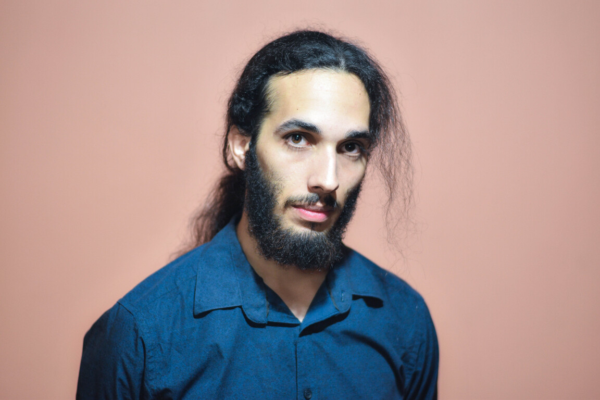

# Pablo Maximiliano Pellegrini

### Legajo: 160.844-7

---

###### Hola! Te dejo una breve presentación sobre mi :D

Mi nombre es Pablo, tengo 23 Años y estoy en la UTN desde hace 3 años, esta es la primera vez que curso esta materia y  siempre quise cursar esta materia por lo que tengo muchas expectativas respecto a la cursada.

Trabajo como Freelance desarrollando paginas webs utilizando **React**, tengo conocimientos en otros lenguajes de programación ( *C#, Go, C++* ), pero por el momento estoy muy metido en lo que es **Javascript.**

---

Respondiendo la pregunta del profesor, si tengo mascotas, 1 perra adoptada de la calle que se llama **Queen** tiene 2 años y también tengo 2 gatos adoptados de la calle **Tea, Moe**.

Ella es **Queen**

---

Respecto a lo que me gusta hacer fui Fotógrafo por un tiempo pero nada profesional solo por hobbie, también me gusta mucho **Tocar la guitarra** es lo que mayormente hago en los tiempos libres, si te interesa tengo unos videos subidos a YouTube donde toco la guitarra https://youtu.be/ZB24FGs2OtQ, también me gustan los **Videojuegos** y mirar series, mi series favorita es **Breaking Bad y Game of Thrones.**

---

*Creo que es suficiente para una pequeña introducción sobre mi, espero que nos podamos conocer mejor en el transcurso de la cursada :D !*

Encontré un buen software para Markdown (**Typora**), así que si estas leyendo esto y todavía no hiciste tu presentación te la recomiendo.

*Hace 1 semana me corte el pelo, pero publico esta foto que es de mi Curriculum porque es la única decente que tengo por el momento*.

